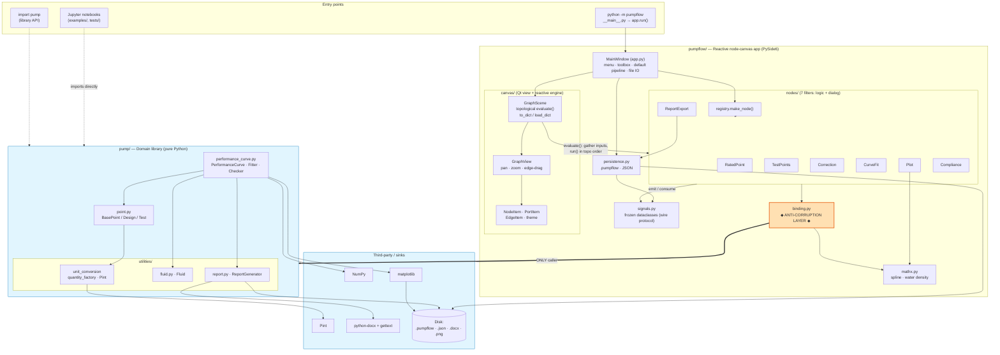

# System Architecture Blueprint — CentrifugalPump

> A reverse-engineered, whole-repository architecture reference for the
> `CentrifugalPump` project: the `pump` engineering library and the `pumpflow`
> visual workbench built on top of it.

| | |
|---|---|
| **Scope** | Entire repository (~6,200 LoC across `pump/` and `pumpflow/`) |
| **Audience** | Maintainers, reviewers, and contributors evaluating design and risk |
| **Status** | Descriptive (as-built), not aspirational |
| **Related docs** | [Run & Test Tutorial](RUN_AND_TEST.md) · [pumpflow UI docs](../pumpflow/docs/index.md) · [`UI_SPEC.md`](../UI_SPEC.md) |

---

## Table of contents

1. [Executive system architecture](#1-executive-system-architecture)
2. [Component topology (visual map)](#2-component-topology-visual-map)
3. [Core domains & design patterns](#3-core-domains--design-patterns)
4. [Coupling, dependencies & risk spots](#4-coupling-dependencies--risk-spots)
5. [Architectural confidence score](#5-architectural-confidence-score)
6. [Appendix: file & responsibility index](#appendix-file--responsibility-index)

---

## 1. Executive system architecture

### 1.1 The system is two stacked subsystems

The repository is a **layered domain library** with a **reactive dataflow GUI
application** built on top of it, joined through a single disciplined adapter
seam. The two subsystems are deliberately different paradigms:

| Subsystem | Paradigm | Role |
|---|---|---|
| [`pump/`](../pump) | **Layered domain library** (rich domain model) | The engine: API 610 pump physics — units, fluids, points, performance curves, compliance checking, `.docx` reporting. No UI, no Qt. |
| [`pumpflow/`](../pumpflow) | **Pipes-and-filters / reactive dataflow** (Orange3-inspired) on a **PySide6 MVC** shell | The workbench: a visual node graph where engineers wire widgets; typed signals flow downstream with topological recompute. Delegates *all* physics to `pump`. |

The single most important design decision is the **Anti-Corruption Layer (ACL)**
at [`pumpflow/binding.py`](../pumpflow/binding.py), documented in-source as *"the
single place where the UI calls into the `pump` library."* The GUI never touches
`pump` internals except through this module. This is textbook Ports-and-Adapters
thinking applied at the package boundary, and it is the strongest structural
property in the codebase.

### 1.2 Primary tech stack

| Concern | Technology |
|---|---|
| Language / runtime | Python **3.12** (uses PEP 701 f-strings and `typing.Self`) |
| Units & dimensional safety | [Pint](https://pint.readthedocs.io) |
| Numerics & fitting | NumPy (`polyfit`/`polyval`), a hand-rolled natural cubic spline |
| Plotting | Matplotlib (`Agg`/interactive) |
| Reporting | `python-docx` + `gettext` (EN/PT localization) |
| Desktop UI | PySide6 (`QGraphicsView` scene/view/items) |
| Packaging | setuptools + `pyproject.toml`; `pip install -e .` |

> ⚠️ **Stack caveat:** `pyproject.toml` declares `requires-python = ">=3.6"`, but
> the source uses Python 3.12-only syntax. The effective floor is **3.12**. See
> [§4](#4-coupling-dependencies--risk-spots).

### 1.3 Layer responsibilities

**`pump/` — domain core (pure Python, no GUI):**

| Layer | Module | Responsibility |
|---|---|---|
| Foundation | [`utilities/unit_conversion.py`](../pump/utilities/unit_conversion.py) | Pint registry, `quantity_factory`, `STANDARD_UNITS` canonicalization, context inference |
| Foundation | [`utilities/fluid.py`](../pump/utilities/fluid.py) | `Fluid` value object (density + dynamic properties) |
| Foundation | [`utilities/report.py`](../pump/utilities/report.py) | `ReportGenerator` → `.docx`, `LocalizationHelper` (gettext) |
| Entity | [`point.py`](../pump/point.py) | `BasePoint → DesignPoint / Point / TestPoint`: per-point hydraulics |
| Aggregate | [`performance_curve.py`](../pump/performance_curve.py) | `PerformanceFitter`, `PerformanceCurve` (affinity transforms + plotting), `PerformanceChecker` (verdicts) |

**`pumpflow/` — application (PySide6 + matplotlib + numpy + `pump`):**

| Layer | Module(s) | Responsibility |
|---|---|---|
| Wire protocol | [`signals.py`](../pumpflow/signals.py) | Immutable `@dataclass(frozen=True)` payloads passed between nodes |
| Adapter (ACL) | [`binding.py`](../pumpflow/binding.py) | The **only** importer of `pump`; converts signals ↔ library objects |
| Ported math | [`mathx.py`](../pumpflow/mathx.py) | `NaturalCubicSpline`, `water_density_kgm3` (not yet in `pump`) |
| View (Qt) | [`canvas/`](../pumpflow/canvas) | `GraphScene` (reactive engine), `GraphView`, `NodeItem`/`PortItem`/`EdgeItem`, `theme` |
| Filters | [`nodes/`](../pumpflow/nodes) | Seven `BaseNode` widgets: each a `compute()` (logic) + `create_dialog()` (Qt view) |
| Persistence | [`persistence.py`](../pumpflow/persistence.py) | `.pumpflow` project files + interchange JSON |
| Shell | [`app.py`](../pumpflow/app.py) | `MainWindow`, menus, default pipeline, file IO, entry point |

---

## 2. Component topology (visual map)



### 2.1 Data flow (happy path)

```
RatedPoint ─┐
            ├─▶ Correction ─▶ CurveFit ─┬─▶ Plot
TestPoints ─┘  (to_speed →    (polyfit  ├─▶ Compliance ─▶ APPROVED / REJECTED
               to_fluid)       + spline) └─▶ ReportExport ─▶ .docx / .json / .png
```

The `ReportExport` `branch` input is **multi-connection**: one shared `RatedPoint`
fans out to N pump branches that each correct/fit/check independently, then merge
into one consolidated report (the A/B two-pump case).

### 2.2 System boundaries & integration touchpoints

- **`binding.py` is the only seam** between the two subsystems — a single
  `from pump import ...` line. Everything physics-related crosses here.
- **`ReportGenerator` and matplotlib** are the only components that write external
  artifacts (`.docx`, `.png`).
- **The notebooks are a parallel, unmanaged entry point.** Per the project's own
  notes, the reference notebook (`examples/pump_api610_performance 1.ipynb`) still
  reimplements the workflow standalone; the library is being evolved to host it.

---

## 3. Core domains & design patterns

### Domain A — Units & quantities (foundation)
- **Classes/functions:** `UnitConverterInterface` (ABC), `ImprovedQuantity`, `quantity_factory`, `STANDARD_UNITS`, `Fluid`.
- **Responsibility:** Every physical value is a Pint `Quantity` normalized to a canonical unit via *context* strings (`"default"`, `"atm"`, `"delta"`). `extract_context` infers context from an attribute-name prefix.
- **Patterns:** **Strategy/Interface** (ABC + impl) · **Factory** (`quantity_factory`, the declared "entry point of engineering-units consistency check") · **Value Object** with custom `__eq__`/`__hash__` (`Fluid`).

### Domain B — Points & curves (the engine)
- **Classes:** `BasePoint`, `DesignPoint`, `Point`, `TestPoint`, `PerformanceFitter`, `PerformanceCurve`.
- **Responsibility:** Model operating points and collections; compute head/power/efficiency; apply pump affinity laws (`to_speed`, `to_fluid`).
- **Patterns:** **Lazy initialization / memoization** (every `*_coeffs` and point property caches on first access) · **Prototype-style immutability** (`to_speed`/`to_fluid` always return a *new* `PerformanceCurve`) · **dynamic attributes** (kwargs → `setattr` in `__init__`).

### Domain C — Compliance & reporting (verdicts + output)
- **Classes:** `PerformanceChecker`, `ReportGenerator`, `LocalizationHelper`.
- **Responsibility:** Apply API 610 tolerance bands (head ±3 %, tiered shut-off 5/8/10 %, power +4 %) → tabulated pass/fail; render localized `.docx`.
- **Patterns:** **Template Method** (`generate_report` orchestrates `_add_*` steps) · **Strategy** (gettext locale selection) · tolerance-tier **rule table** (`_get_shutoff_tolerance`).

### Domain D — Reactive dataflow engine (pumpflow core)
- **Classes:** `GraphScene`, `BaseNode`, `PortSpec`, the six signal dataclasses, `registry.make_node`.
- **Responsibility:** Topologically order nodes (Kahn's algorithm in `_topo_order`), gather upstream `outputs_cache`, run each node, surface per-node state (`idle/ok/invalid/error/reject`).
- **Patterns:** **Pipes-and-Filters** · **Template Method** (`BaseNode.run → compute`) · **Registry** (`_BY_KIND`) · **Factory** (`make_node`) · **Observer/Reactive** (Qt `Signal` + `evaluate()`) · **Immutable Message** (frozen dataclasses, `replace`-based re-emission).

### Domain E — Adapter & integration (binding)
- **Functions:** `correct_curve`, `fit_model`, `check_compliance`, `assemble_report_data`, `BindingError`.
- **Responsibility:** The Anti-Corruption Layer — convert flat UI signals to `pump` objects and back. No physics is re-implemented here.
- **Patterns:** **Adapter / ACL** · **Facade** (one flat API over many library calls) · exception **wrapping** (`BindingError`).

---

## 4. Coupling, dependencies & risk spots

### 🔴 Critical

1. **No automated tests.** `pyproject` lists `pytest`, but `tests/` contains only
   two Jupyter notebooks — there is no `def test_*` anywhere. For a library that
   produces safety-relevant FAT acceptance verdicts, this is the single biggest
   risk; every refactor below is unguarded. (README TODO #2: *"Add testing."*)
   The [Run & Test tutorial](RUN_AND_TEST.md) provides a ready-to-run starter
   suite to close this gap.

2. **Confirmed bug — `NameError` in the units core.**
   [`unit_conversion.py`](../pump/utilities/unit_conversion.py) catches
   `except pint.UndefinedUnitError` / `pint.DimensionalityError`, but the module
   only does `from pint import UnitRegistry, Quantity` — the name `pint` is never
   bound. If either path is hit you get a `NameError` masking the real error, in
   the foundation layer everything depends on.

3. **Python-version contradiction.** Metadata says `>=3.6`; the code uses PEP 701
   nested-quote f-strings (e.g. in `report.py`, `performance_curve.py`) and
   `typing.Self`, requiring **3.12+**. The package cannot import on most versions
   the metadata claims.

### 🟠 Architectural smells

4. **`PerformanceCurve` is a ~775-line near-God-class.** `plot_performance_curve`
   alone is ~160 lines interleaving computation, matplotlib styling, crosshair
   annotation, and BytesIO export — the most fragile code in the repo. Three
   near-identical `predict_*` methods and three near-identical `*_coeffs` fitter
   properties beg to be parameterized.

5. **DRY violations across the point hierarchy.** `pressure_head`,
   `inlet_velocity`, `outlet_velocity`, `velocity_head`, `elevation_head`,
   `compute_head`, and `head` are copy-pasted between `Point` and `TestPoint` (and
   partly into `DesignPoint`). Also: `Point.outlet_pressure` calls
   `quantity_factory()` with **no arguments** → guaranteed `TypeError` (dead/broken).

6. **`hasattr`/duck-typing as control flow.** Both packages lean on dynamically-set
   kwargs + `hasattr(...)` guards. There is no schema, so a typo silently degrades
   to `"N/A"`. Existing typos prove the fragility: `"Head Shuttoff"`, `"Hydralic
   Power"` in `performance_curve.py`; `"utilites"` in `report.py` docstrings.

7. **Binding reaches into library private state.** `binding.correct_curve` pins
   `_head` and `_efficiency` (underscored privates) onto `TestPoint`s to work
   around the **single-fluid-per-curve** constraint. Documented as deliberate, but
   it couples the UI to library internals — the exact leak an ACL should prevent.

8. **Nodes mix two responsibilities (SRP).** Each node is *both* dataflow logic
   (`compute`) *and* a 100–150-line Qt dialog builder (`create_dialog`). Contained
   and consistent, but it makes node logic un-unit-testable without a `QApplication`.

9. **Duplicated/temporary math.** `NaturalCubicSpline` and `water_density_kgm3`
   live in `mathx.py` and conceptually belong in `pump`. The water-density
   polynomial is a placeholder "Kell-style" fit, not the notebook's exact
   coefficients — a numerical-fidelity risk for the head column.

10. **Version drift / undeclared deps.** `pump.__version__ = "0.0.1"` vs
    `pyproject = "0.1.0"` vs `pumpflow = "0.1.0"`; PySide6 is not declared as a
    dependency anywhere; `tests/pyproject.toml` lists `python-docx` twice.

### Fragile zones — handle with extra care

- `PerformanceCurve.to_speed` (commented-out dead block; pins `_efficiency`
  unchanged across a speed change — a physical approximation) and
  `plot_performance_curve`.
- `unit_conversion.ImprovedQuantity.convert` (the temperature/`delta` special-case
  plus the broken `pint.*` except clauses).
- `binding.correct_curve` (the private-attribute pinning).
- `scene.evaluate` cycle handling (cycles are silently appended in stable order
  rather than rejected).

---

## 5. Architectural confidence score

### **6.5 / 10**

**Strengths.** The separation of concerns is genuinely good for a young project.
The `pump`/`pumpflow` split is clean; the **ACL discipline in `binding.py`** is the
kind of boundary many mature codebases lack. The reactive dataflow engine is small,
correct (proper Kahn topological sort), and well-suited to the domain. Signals are
immutable, the unit system is principled, and documentation is unusually thorough —
every module docstring maps to a `UI_SPEC` section.

**What holds it back.** No tests on safety-relevant math; a confirmed `NameError`
in the foundation layer; a Python-version claim the code violates; a ~775-line
God-class; and substantial copy-paste duplication across the point hierarchy. These
are correctness-and-maintainability problems, not merely style.

### Three recommendations (priority order)

1. **Establish a test harness before any further refactor.** Pin the numeric
   outputs of `quantity_factory`, `PerformanceCurve.to_speed/to_fluid`,
   `PerformanceChecker` verdicts, and `binding.check_compliance` against the worked
   `examples/*.ipynb`. Fix the `import pint` bug and the `>=3.6 → >=3.12` metadata
   as the first two commits under that net. *(Starter suite supplied in the
   [tutorial](RUN_AND_TEST.md).)*

2. **Collapse the point hierarchy and tame `PerformanceCurve`.** Extract the
   duplicated hydraulics into a `HydraulicPointMixin`; delete the broken
   `Point.outlet_pressure`. Split `plot_performance_curve` into a pure
   `curve_samples()` data method + a thin renderer, and parameterize the three
   `predict_*`/`*_coeffs` triplets.

3. **Promote `mathx.py` into `pump` and formalize the signal contract.** Move
   `NaturalCubicSpline`/`water_density_kgm3` into the library (with the notebook's
   exact coefficients) and add a per-point-fluid path to `PerformanceCurve` so
   `binding.py` can drop the `_head`/`_efficiency` private-pinning workaround. This
   removes the only real leak in an otherwise clean boundary and lets the library
   fully host the notebook's UX — the stated project goal.

---

## Appendix: file & responsibility index

| Path | LoC | Responsibility |
|---|---:|---|
| `pump/utilities/unit_conversion.py` | 213 | Pint registry, `quantity_factory`, `STANDARD_UNITS` |
| `pump/utilities/fluid.py` | 115 | `Fluid` value object |
| `pump/utilities/report.py` | 428 | `ReportGenerator` (`.docx`), localization |
| `pump/point.py` | 410 | `BasePoint`/`DesignPoint`/`Point`/`TestPoint` |
| `pump/performance_curve.py` | 775 | `PerformanceFitter`/`PerformanceCurve`/`PerformanceChecker` |
| `pumpflow/signals.py` | 234 | Frozen dataclass payloads |
| `pumpflow/binding.py` | 512 | Anti-Corruption Layer to `pump` |
| `pumpflow/mathx.py` | 172 | Spline + water density |
| `pumpflow/persistence.py` | 137 | `.pumpflow` + interchange JSON |
| `pumpflow/app.py` | 284 | MainWindow, default pipeline, file IO |
| `pumpflow/canvas/scene.py` | 206 | Reactive topological engine |
| `pumpflow/canvas/{view,node_item,port_item,edge_item}.py` | ~540 | Qt rendering & interaction |
| `pumpflow/nodes/*.py` | ~1,250 | Seven widgets + base/registry/ui/plotting |

*Line counts are approximate and will drift; regenerate with `wc -l`.*
