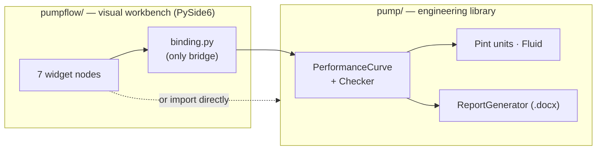

# CentrifugalPump — Documentation

Engineering tools for assessing API 610 centrifugal pumps during Performance and
Mechanical Running Test trials. The repository is two stacked subsystems:

- **`pump/`** — a layered Python **library** of pump physics (units, fluids,
  points, performance curves, API 610 compliance, `.docx` reporting).
- **`pumpflow/`** — a **visual workbench** (PySide6 node canvas) that orchestrates
  the library into a drag-and-wire workflow.

---

## Start here

| Document | What's inside |
|---|---|
| 🏛️ [**Architecture Blueprint**](ARCHITECTURE.md) | Whole-system design: paradigm, topology (Mermaid), domains & patterns, risk spots, and a maturity score with recommendations. |
| 🚀 [**Run & Test Tutorial**](RUN_AND_TEST.md) | Install, run the library, launch the desktop app, and run the test suite — step by step. |

## Deeper references (pumpflow UI)

| Document | What's inside |
|---|---|
| [pumpflow docs index](../pumpflow/docs/index.md) | Documentation map for the UI package |
| [User Guide](../pumpflow/docs/user_guide.md) | Canvas controls and every property dialog |
| [Module Reference](../pumpflow/docs/modules.md) | Per-module / per-class API notes |
| [Data Formats](../pumpflow/docs/data_formats.md) | `.pumpflow` project + interchange JSON |
| **UI As-Built Register** | The as-built functional register for the UI |

---

## 60-second orientation



```bash
# get running in three commands (details in the tutorial)
pip install -e .[dev]
pytest tests/test_pump_smoke.py -v     # 11 passing tests
python -m pumpflow                      # needs: pip install PySide6 matplotlib numpy
```

---

*Generated as part of an architecture review. Descriptive of the code as-built;
see the [blueprint](ARCHITECTURE.md) for known issues and recommended fixes.*
