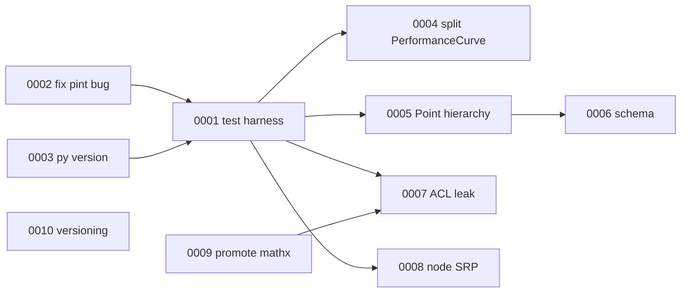

# Architecture Decision Records (ADRs)

This folder tracks proposed architectural improvements for **CentrifugalPump**,
derived from the [Architecture Blueprint](../ARCHITECTURE.md). Each record is a
self-contained proposal: context, the decision, and its consequences.

## What is an ADR?

A short document capturing one architecturally significant decision. We use a
lightweight [MADR](https://adr.github.io/madr/)-style template. ADRs are
**append-only**: to change a decision, add a new ADR that supersedes the old one
rather than editing history.

## Status legend

| Status | Meaning |
|---|---|
| `Proposed` | Recommended, not yet accepted/scheduled. |
| `Accepted` | Agreed; implementation pending or in progress. |
| `Done` | Implemented and verified. |
| `Superseded` | Replaced by a later ADR. |
| `Rejected` | Considered and declined. |

## Tracking index — ordered by criticality

| ADR | Title | Criticality | Status |
|---|---|---|---|
| [0001](0001-establish-automated-test-harness.md) | Establish an automated test harness | 🔴 Critical | `Proposed` (starter suite landed) |
| [0002](0002-fix-pint-nameerror-in-units-core.md) | Fix the `pint` `NameError` in the units foundation | 🔴 Critical | `Proposed` |
| [0003](0003-correct-python-version-floor.md) | Correct the Python version floor metadata | 🔴 Critical | `Proposed` |
| [0004](0004-refactor-performancecurve-god-class.md) | Refactor `PerformanceCurve`: split plotting from computation | 🟠 High | `Proposed` |
| [0005](0005-consolidate-point-hierarchy.md) | Consolidate the `Point` hierarchy & remove broken code | 🟠 High | `Proposed` |
| [0006](0006-replace-hasattr-duck-typing.md) | Replace `hasattr` duck-typing with an explicit schema | 🟡 Medium | `Proposed` |
| [0007](0007-remove-acl-private-state-leak.md) | Remove the ACL leak: private-attribute pinning in `binding` | 🟡 Medium | `Proposed` |
| [0008](0008-separate-node-logic-from-qt-dialogs.md) | Separate node logic from Qt dialogs | 🟡 Medium | `Proposed` |
| [0009](0009-promote-mathx-into-pump-library.md) | Promote `mathx` into the `pump` library | 🟢 Low | `Proposed` |
| [0010](0010-align-versioning-and-declare-deps.md) | Align versioning & declare GUI dependencies | 🟢 Low | `Proposed` |

## Suggested sequencing

Land the 🔴 critical trio first (**0002 + 0003** are tiny prerequisites; **0001**
makes everything after it safe). Then tackle the 🟠 high-impact refactors
(**0004, 0005**) under the test net. The 🟡/🟢 records are quality-of-life and can
be scheduled opportunistically.

