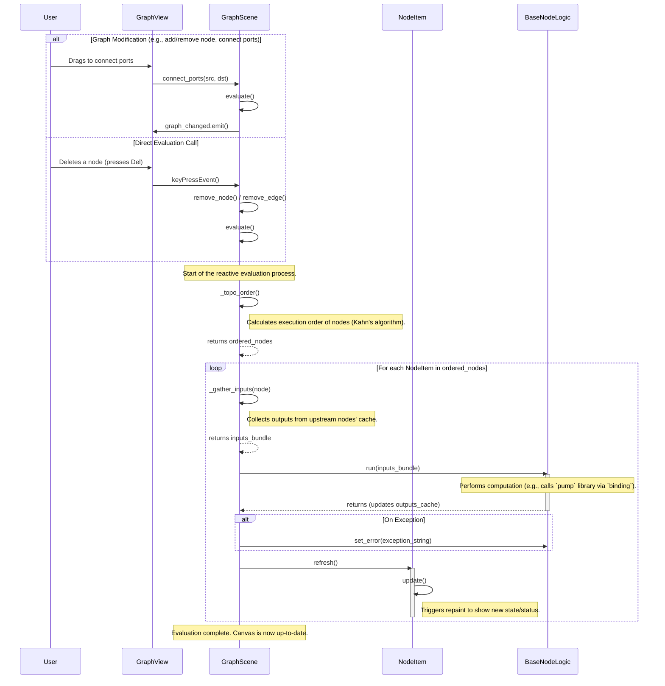

# Reactive Evaluation Sequence Diagram

This document provides a UML sequence diagram illustrating the reactive evaluation process within the `pumpflow` canvas. This process is triggered whenever the graph changes, ensuring the entire pipeline remains up-to-date. The core logic resides in `GraphScene.evaluate()`.

