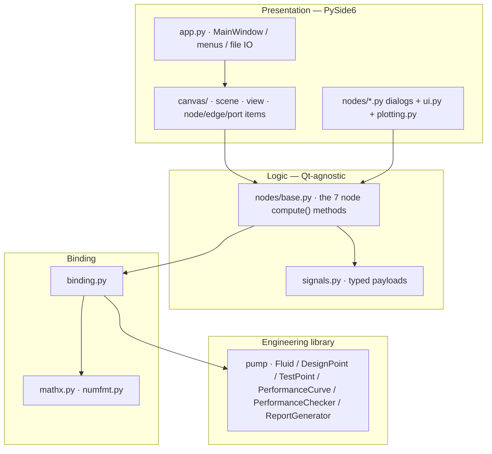
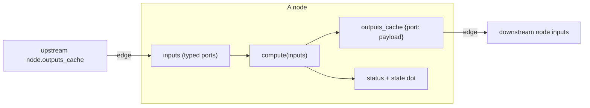
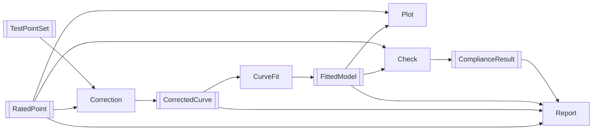
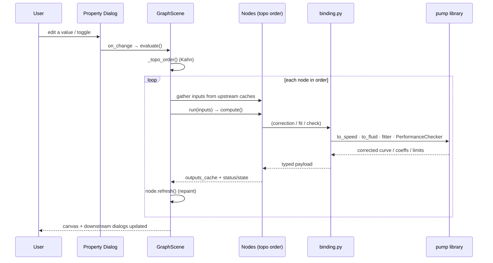
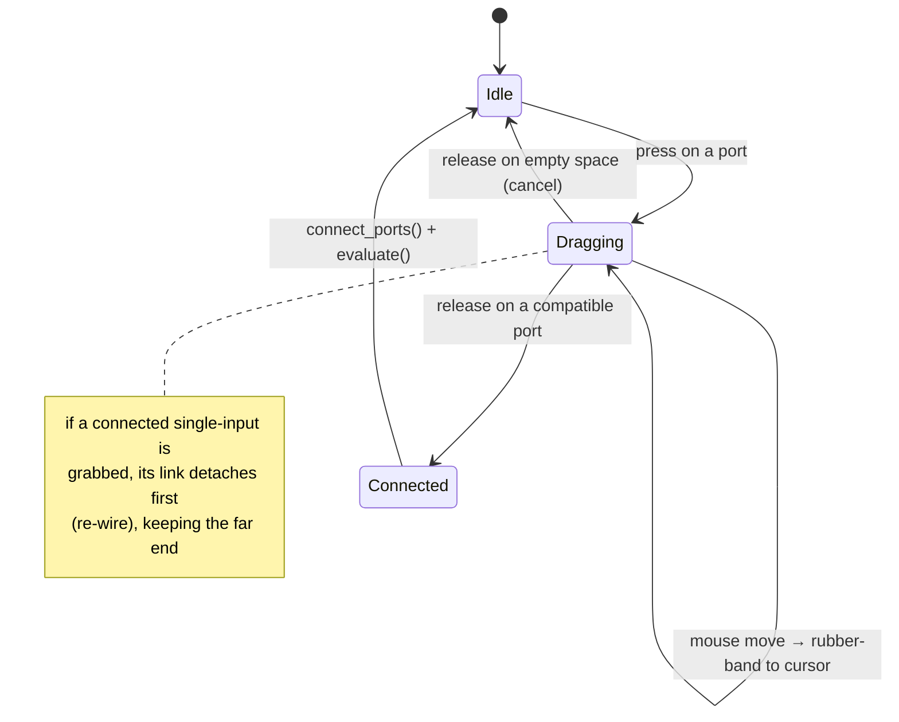
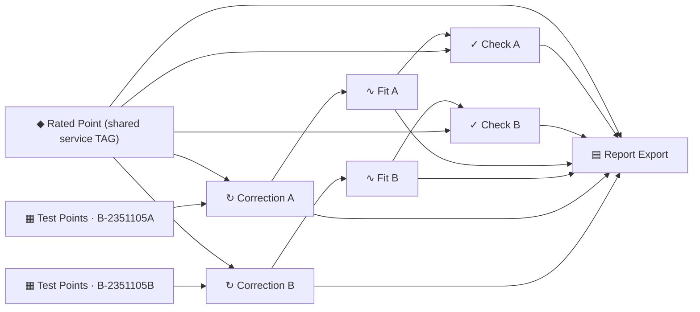
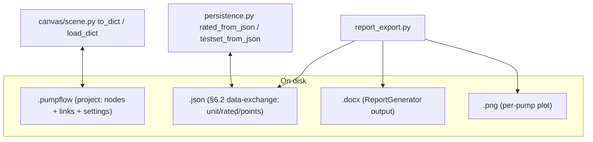

# Architecture

PumpLab is organized in four layers. Each layer depends only on the ones below
it, and **only `binding.py` is allowed to import from the `pump` library** — this
keeps the engineering physics in one auditable place.

---

## 1. The reactive data-flow model

Widgets never call each other directly. Each node declares typed **input** and
**output** ports; a link copies one node's cached output payload to another node's
input. When anything changes, the scene recomputes the whole graph in
dependency order.

### Signal types and the ports that carry them

Port compatibility rule (`port_item.PortItem.can_accept`): an output may connect
to an input when the signal types match (or either side is the wildcard `*`, used
by Report Export's `branch` input and the Plot's `image` output), the two ports
are on different nodes, and a **single-connection input** is not already occupied.

---

## 2. The evaluation loop

`GraphScene.evaluate()` runs on every meaningful change — a dialog edit, a new or
removed link, a deleted node, or a project load.

**Ordering** uses a stable Kahn topological sort over the link graph; nodes left
over from a cycle are appended deterministically so evaluation never hangs.
**Error isolation**: a node that raises is caught and shown with an `error` state
and message (UI_SPEC §7) — its neighbours still evaluate.

---

## 3. Interactive edge creation

All link dragging lives in `GraphView` (not in the ports) so the view keeps full
control of the mouse and there is no grabber ambiguity.

Fan-out is supported because **output ports are always multi-connection**; merge
is supported because the Report Export `branch` input is declared `multi=True`.

---

## 4. The two-pump (A/B) topology

One shared **Rated Point** (the service datasheet) fans out to two independent
branches, each with its own **Test Points Table** (a physical unit TAG). Every
branch payload carries its `pump_tag`, so Report Export groups them unambiguously
into one consolidated document, and overall acceptance reflects **all** pumps.

---

## 5. Persistence boundaries

- **`.pumpflow`** captures the entire canvas — node kinds, positions, links, and
  each widget's `settings`. It is the "save my work" format.
- **§6.2 JSON** is the lightweight interchange shape (single rated point + measured
  rows) and round-trips with existing files, including comma-decimal strings.
