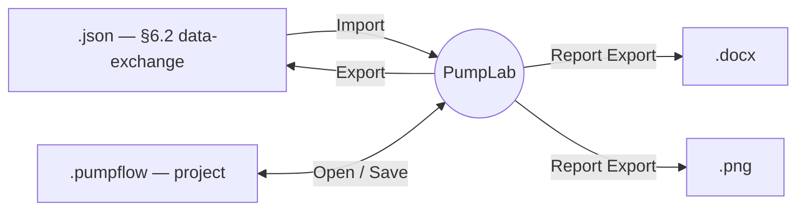

# Data Formats

PumpLab reads and writes four artifacts. Two are inputs/interchange you will edit
or share; two are outputs.



---

## 1 · Data-exchange JSON (UI_SPEC §6.2)

The lightweight interchange format: one rated point and a set of measured rows.
**Numbers may be JSON numbers or strings**, and strings may use comma **or** dot
decimals plus thousands separators (`"858,29"`, `"78.552"`, `"1.234,56"`). This is
what `File ▸ Import/Export data file` reads and writes, and the shape of the
seeded sample.

```json
{
  "unit": "bar",
  "rated": {
    "tag": "B-2351105",
    "standard": "API610 (12a ed.) / ISO 13709 + N-553",
    "q_m3h": "833",
    "head_m": "73",
    "n_rpm": "1750",
    "power_kw": "252",
    "eff_pct": "61",
    "dens_rel": "0,736",
    "visc_nom_cst": "0,567",
    "head_shutoff": "117",
    "parallel": false
  },
  "pump_tag": "B-2351105A",
  "points": [
    { "q": "300",    "p_suc": "1,80", "p_dis": "12,53", "temp_c": "34", "power": "248",    "n_rpm": "1799" },
    { "q": "858,29", "p_suc": "1,81", "p_dis": "9,47",  "temp_c": "34", "head": "78.552", "power": "298,69", "n_rpm": "1799" }
  ]
}
```

### Field reference

**`unit`** — pressure unit for `p_suc` / `p_dis`. Accepted: `"bar"`,
`"kgf/cm**2"` (also `"kgf/cm2"`, `"kgf/cm²"`).

**`rated`** (object)

| Key | Meaning | Unit |
|---|---|---|
| `tag` | service / datasheet TAG (shared) | — |
| `standard` | applicable standard text | — |
| `q_m3h` | rated capacity | m³/h |
| `head_m` | rated differential head | m |
| `n_rpm` | rated speed | rpm |
| `power_kw` | rated breaking power | kW |
| `eff_pct` | rated efficiency *(optional)* | % |
| `head_shutoff` | rated shut-off head *(optional)* | m |
| `dens_rel` | relative density (SG) | — |
| `visc_nom_cst` | nominal viscosity | cSt |
| `parallel` | parallel-operation flag | bool |

**`pump_tag`** — physical unit TAG (unique per branch). If omitted on import,
defaults to `rated.tag + "A"`.

**`points`** (array) — one object per measured row.

| Key | Meaning | Unit |
|---|---|---|
| `q` | measured capacity | m³/h |
| `p_suc` | suction pressure | `unit` |
| `p_dis` | discharge pressure | `unit` |
| `temp_c` | test-water temperature | °C |
| `n_rpm` | measured speed | rpm |
| `power` | measured breaking power | kW |
| `head` | measured/overridden head *(optional)* | m |
| `eff` | measured efficiency *(optional)* | % |

If `head` is omitted it is computed as `(P_dis − P_suc) / (ρ·g)` using water
density at `temp_c`. If `eff` is omitted it is computed from hydraulic vs.
breaking power.

> **Round-trip:** the exporter (`json_from_signals`) writes this exact shape, so
> existing files stay interoperable. Exported numbers are normalized to plain
> numerics; the importer still accepts the comma-decimal strings.

---

## 2 · Project file — `.pumpflow` (UI_SPEC §6.1)

The full canvas: every node (kind, position, settings) and every link. This is
the "save my work" format, written/read by `GraphScene.to_dict` / `load_dict`
via `File ▸ Save/Open project`.

```json
{
  "nodes": [
    {
      "id": "rated_point-1",
      "kind": "rated_point",
      "x": -660.0,
      "y": -170.0,
      "settings": {
        "tag": "B-2351105", "q": 833.0, "head": 73.0, "n": 1750.0,
        "power": 252.0, "eff": 61.0, "head_shutoff": 117.0,
        "dens_rel": 0.736, "visc": 0.567, "unit": "bar", "parallel": false
      }
    },
    {
      "id": "test_points-2",
      "kind": "test_points",
      "x": -660.0, "y": 150.0,
      "settings": { "pump_tag": "B-2351105A", "unit": "bar", "rows": [ /* … */ ] }
    }
  ],
  "edges": [
    { "src_node": "rated_point-1", "src_port": "RatedPoint",
      "dst_node": "correction-3",  "dst_port": "RatedPoint" }
  ]
}
```

- **`nodes[].kind`** must be one of the registry kinds: `rated_point`,
  `test_points`, `correction`, `curve_fit`, `performance_plot`, `compliance`,
  `report_export`.
- **`nodes[].settings`** is each widget's own settings dict (see the Module
  Reference for per-node `default_settings`).
- **`edges[]`** reference ports by name; unknown nodes/ports are skipped on load
  (forward-compatible).

---

## 3 · Report outputs

- **`.docx`** — produced by `pump.ReportGenerator` from a `report_data` dict
  (`assemble_report_data`): a shared `equipment_description` + `design_point`, and
  one `test_data` entry **per pump TAG** (test summary, raw test data, plot PNG).
  Needs `template_en.docx` / `template_pt.docx`.
- **`.json`** (from Report Export) — a richer bundle than §6.2: service-level
  identity, shared rated point, equipment, and a `pumps[]` array carrying each
  unit's verdict, per-parameter checks, and corrected curve data.
- **`.png`** — per-pump performance plot (the library's Matplotlib figure).
