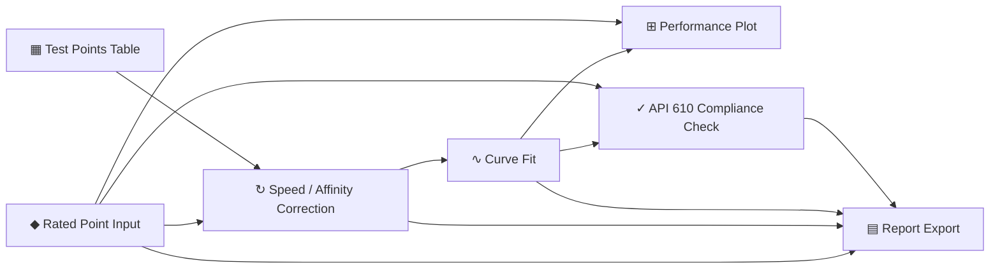

# PumpLab — Documentation

> **API 610 Pump Performance Workbench** — an Orange3-style node-canvas desktop
> application that turns rated data + Factory Acceptance Test (FAT) measurements
> into corrected curves, plots, an API 610 verdict, and a report.

PumpLab ships the `pumpflow/` package: a thin, **reactive** PySide6 user-interface
layer on top of the existing `pump` engineering library. You build a workflow by
dragging widgets onto a canvas and wiring their ports; signals flow along the
links and every downstream widget recomputes automatically.

---

## Documentation map

| Document | What's inside |
|---|---|
| [Release Notes](RELEASE_NOTES.md) | Summary, highlights, changelog, migration guide |
| [Architecture](architecture.md) | System design + **Mermaid** workflow diagrams |
| [User Guide](user_guide.md) | Canvas controls and every property dialog |
| [Module Reference](modules.md) | Per-module / per-class API documentation |
| [Data Formats](data_formats.md) | `.pumpflow` project + §6.2 data-exchange JSON |

---

## Capabilities at a glance

- **Visual workflow** — seven widgets on a pannable/zoomable canvas with typed,
  color-coded ports; fan-out and merge supported.
- **Reactive recompute** — edit a rated value or paste new test points and the
  correction, fit, plot, verdict, and report update in dependency order.
- **API 610 compliance** — per-parameter deviation table with editable tolerances
  and a bold APPROVED / REJECTED verdict.
- **Two-pump A/B** — one shared Rated Point fans out to parallel branches that
  merge into one consolidated report.
- **Interchange** — `.pumpflow` project files and UI_SPEC §6.2 JSON (with
  locale-style comma decimals).
- **Reporting** — embedded Matplotlib plots and `.docx` / `.json` / `.png` export.

---

## Quick start

```bash
# from the CentrifugalPump repo root (branch: orange), with pumpflow/ in place
pip install -e .                      # the pump library (pint, python-docx, tabulate)
pip install PySide6 matplotlib numpy  # the UI dependencies
python -m pumpflow                    # launch
```

The app opens with a **default pre-wired pipeline** populated with realistic
seeded single-pump data, so you immediately see corrected points, a fitted curve,
and a verdict. Double-click any node to open its property dialog.

---

## The seven widgets



| Widget | Emits | Spec |
|---|---|---|
| Rated Point Input | `RatedPoint` | §5.1 |
| Test Points Table | `TestPointSet` | §5.2 |
| Speed / Affinity Correction | `CorrectedCurve` | §5.3 |
| Curve Fit | `FittedModel` | §5.4 |
| Performance Plot | `image/png` | §5.5 |
| API 610 Compliance Check | `ComplianceResult` | §5.6 |
| Report Export | (terminal) | §5.7 |

---

## Project layout

```text
pumpflow/
├── __init__.py          package metadata
├── __main__.py          `python -m pumpflow`
├── app.py               MainWindow, menus, default pipeline, file IO
├── signals.py           §3 typed payload dataclasses
├── binding.py           §4 the only bridge into the `pump` library
├── mathx.py             §4 note — NaturalCubicSpline + water density
├── numfmt.py            locale-tolerant number parse/format
├── persistence.py       §6.2 JSON + generic file IO
├── sample_data.py       seeded single-pump (+ Pump B) datasets
├── style.py             global Qt stylesheet (industrial steel, light)
├── canvas/
│   ├── theme.py         palette + metrics
│   ├── port_item.py     typed connection points
│   ├── edge_item.py     bezier links
│   ├── node_item.py     node rendering + status line
│   ├── view.py          pan/zoom + interactive edge dragging
│   └── scene.py         reactive graph: eval, (de)serialize
└── nodes/
    ├── base.py          BaseNode + PortSpec
    ├── ui.py            shared dialog building blocks
    ├── plotting.py      shared Matplotlib figure builder
    ├── registry.py      kind → class catalog
    └── <seven widget modules>
```
